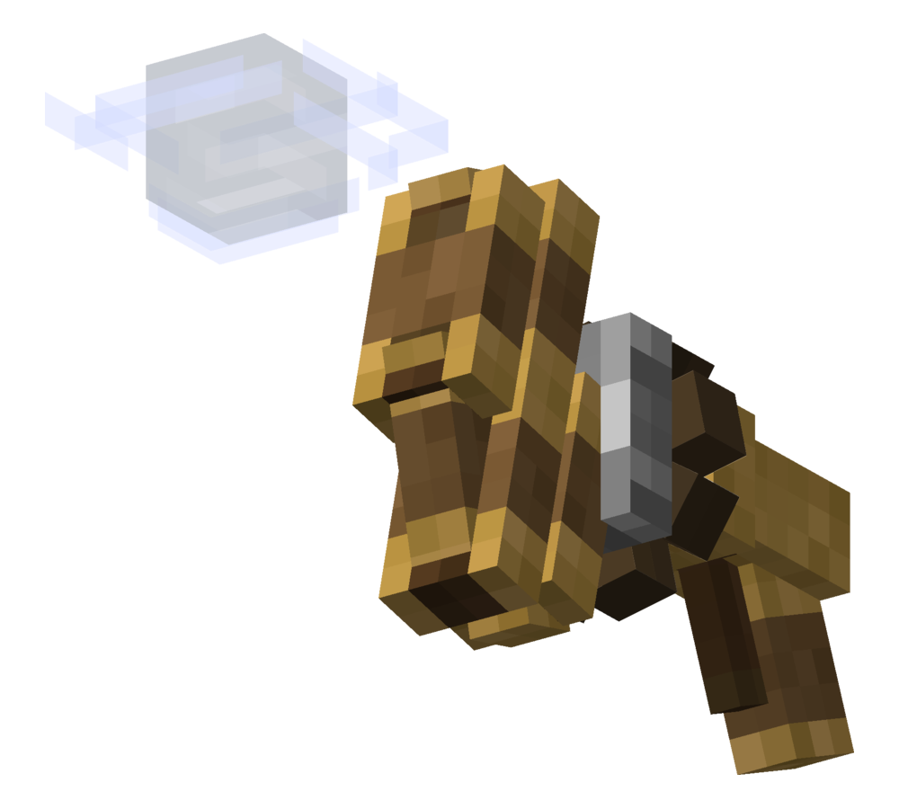

# Create: Airburst

<p align="center">
  
</p>

<p align="center">
  <strong>A Create addon that turns the Extendo Grip into a backtank-powered burst mobility tool.</strong>
</p>

<p align="center">
  
  
  
</p>

## Overview

**Create: Airburst** adds the **Airburst Wand**, an Extendo Grip variant crafted with Breeze components and powered by Create backtank pressure. It keeps the normal Extendo Grip reach behavior, including offhand and mixed Extendo Grip handling, while adding configurable directional burst movement.

The wand uses the Extendo Grip model as its base and swaps the gripper hand for a Wind Charge visual when no held item needs to be displayed.

## Features

| Feature | Details |
| --- | --- |
| Extendo Grip behavior | Functions like Create's Extendo Grip for reach, offhand use, held items, and mixed grip behavior. |
| Airburst | Press `R` by default to launch in the precise direction you are facing. |
| Reverse Airburst | Press `G` by default to launch in the opposite direction. |
| Backtank powered | Survival use consumes `10` backtank pressure units. Creative players do not consume pressure. |
| Configurable tuning | Cooldown and launch velocity are configurable with Create/Catnip config files. |
| Cooldown | Default cooldown is `10` ticks. |
| Sound | Plays the vanilla Minecraft Wind Charge burst sound for nearby players. |
| Fall safety | Prevents fall damage after an Airburst when the landing velocity is low enough. |

## Crafting

Create: Airburst uses Create deploying recipes:

| Step | Deploy | Onto | Result |
| --- | --- | --- | --- |
| 1 | Breeze Rod | Extendo Grip | Incomplete Airburst Wand |
| 2 | Precision Mechanism | Incomplete Airburst Wand | Airburst Wand |

The incomplete item is recipe-only and is not listed in the Creative Mode tab.

## Controls

| Action | Default key | Description |
| --- | --- | --- |
| Airburst | `R` | Adds one burst of velocity in the direction you are looking. |
| Reverse Airburst | `G` | Adds one burst of velocity opposite the direction you are looking. |

Both keybinds can be changed in **Options -> Controls -> Key Binds** under the **Create: Airburst** category.

## Configuration

Create: Airburst registers both common defaults and world/server overrides through the Create/Catnip config system.

| Config | Key | Default | Range |
| --- | --- | --- | --- |
| Common | `defaultAirburstCooldownTicks` | `10` | `0` to `200` |
| Common | `defaultAirburstVelocity` | `1.2` | `0.0` to `10.0` |
| Server | `airburstCooldownTicks` | `10` | `0` to `200` |
| Server | `airburstVelocity` | `1.2` | `0.0` to `10.0` |

Server config values are used for gameplay when present. Common config values provide the default baseline before a world-specific server config is active.

## Requirements

| Dependency | Version |
| --- | --- |
| Minecraft | `1.21.1` |
| NeoForge | `21.1.x` |
| Create | `6.0.8` or newer |

## Building

```bash
gradle --no-daemon build
```

The built jar is generated in:

```text
build/libs/
```

## Project Info

| Field | Value |
| --- | --- |
| Mod ID | `airburst` |
| Package | `com.aquablox.airburst` |
| Current version | `0.1.0` |
| Repository | `https://github.com/aquablox/Airburst` |

## License

Create: Airburst is licensed under the MIT License with an attribution requirement.

Any modified version, fork, redistribution, or derivative work must clearly reference the original **Create: Airburst** project wherever it is officially published, including GitHub or any future location if the project moves.
